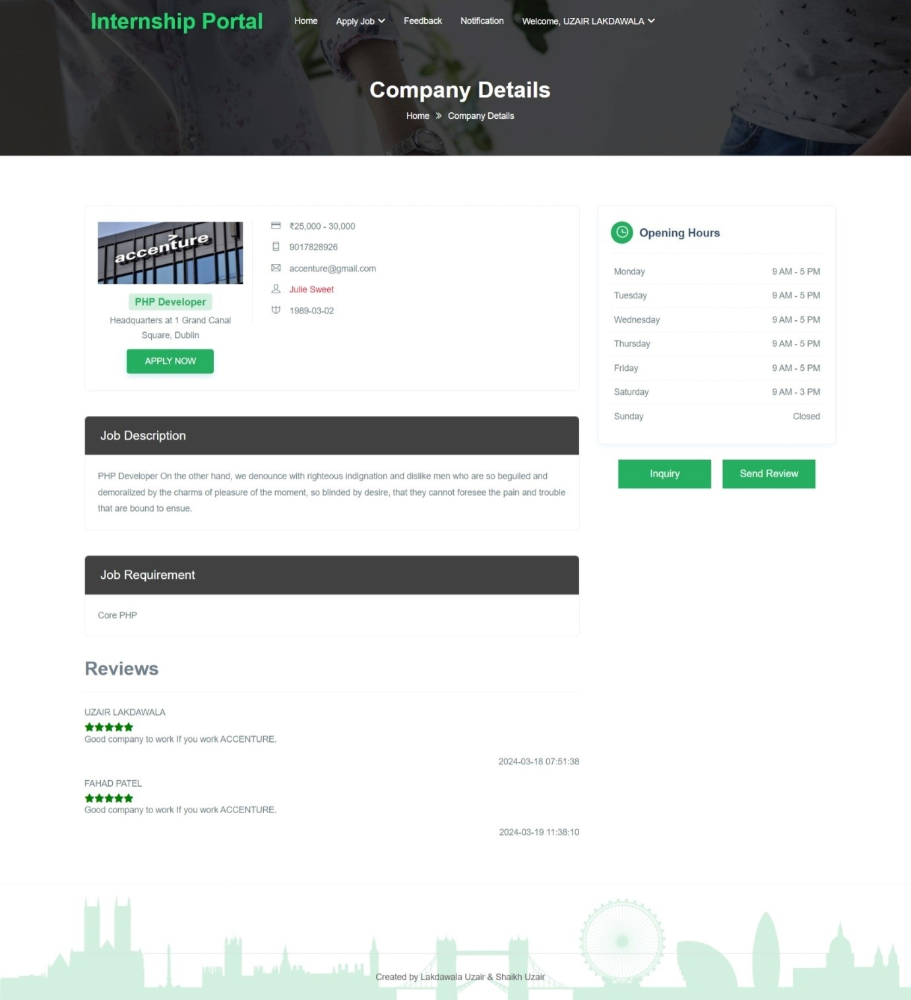
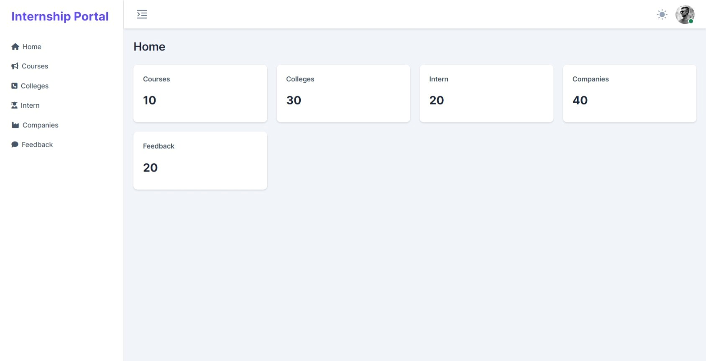

# 🎓 Internship Portal Website – A Web-Based Internship Management Platform

**Author:** Mohammed Uzair Shaikh  
**Institution:** Iqra BCA College, Veer Narmad South Gujarat University  
**Supervisor:** Mr. Swapnil Roy  
**Completion Date:** April 2024  

---

## 🧾 Overview

The **Internship Portal Website** is a dynamic web-based application designed as a Bachelor of Computer Applications (BCA) final-year project.  
It connects students and recent graduates with internship opportunities while helping companies efficiently manage postings and applications.

The system includes three key roles:
- 👨‍🎓 **Student** – Register, create a profile, and apply for internships.  
- 🏢 **Company** – Post internship opportunities and review applications.  
- 🧑‍💼 **Admin** – Manage users, internship listings, and overall system data.

---

## 🧠 Features

- 🔐 Role-based secure login for Admin, Company, and Student  
- 🧾 Student registration, resume upload, and profile management  
- 🏢 Company dashboard for internship postings and application review  
- 🧮 Admin control panel for managing users and listings  
- 📊 Dynamic and responsive UI design  
- 📬 Application tracking and automated status updates  

---

## ⚙️ Technologies Used

| Category | Tools / Technologies |
|-----------|----------------------|
| **Frontend** | HTML, CSS, JavaScript |
| **Backend** | Core PHP |
| **Database** | MySQL |
| **Server** | WAMP / XAMPP |
| **Tools / IDE** | Visual Studio Code |
| **Development Model** | Incremental Software Development Model |

---

## 🖼️ Screenshots

### 🏠 Home Page


### 👨‍🎓 Student Profile


### 🏢 Company Detials


### 🛠️ Admin Panel



## 📂 Project Structure
```

Internship-Portal/
│
├── backend/
│   ├── connect.php
│   ├── login.php
│   ├── register.php
│
├── database/
│   └── internship_portal.sql
│
├── frontend/
│   ├── index.html
│   ├── styles.css
│   └── scripts.js
│
├── screenshots/
│   ├── home_page.png
│   ├── student_dashboard.png
│   ├── company_posting.png
│   └── admin_panel.png
│
├── Bachelor_Thesis_Summary_Uzair.pdf
└── README.md

```

---

## 🧩 Installation & Setup

1. Install **WAMP** or **XAMPP** on your system.  
2. Place this project folder in the `www` (WAMP) or `htdocs` (XAMPP) directory.  
3. Import the file `internship_portal.sql` into **phpMyAdmin** to create the database.  
4. Update database credentials in `connect.php` if required.  
5. Start Apache and MySQL services.  
6. Open your browser and run the app at:  
   👉 [http://localhost/Internship-Portal](http://localhost/Internship-Portal)

---

## 📖 Bachelor Thesis Report

📄 [Bachelor_Thesis_Summary_Uzair.pdf](./Bachelor_Thesis_Summary_Uzair.pdf)

This document summarizes the full academic project report submitted to  
Veer Narmad South Gujarat University as part of the Bachelor of Computer Applications degree.

---

## 👥 Authors

- **Mohammed Uzair Shaikh**  
- **Lakdawala Mohammed Uzair Zahid**

---

## 🔗 Links

- **Live Repository:** [https://github.com/UzairShk/Internship-Portal](https://github.com/UzairShk/Internship-Portal)  
- **Portfolio / Additional Projects:** [https://github.com/UzairShk](https://github.com/UzairShk)

---

## 🪪 License

This project is distributed under the **MIT License** — feel free to use or modify it with proper attribution.

---

⭐ *If you find this project useful, please consider starring the repository!*
